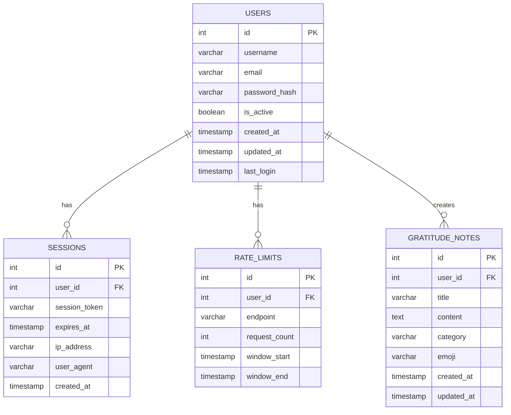

# Future Database Schema Plans

## Planned Features for Test #2

This document outlines the planned database schema changes for implementing the following features:
- Session Management
- User Authentication
- Authorization
- Rate Limiting

## Proposed Schema Changes

## Table Descriptions

### users
| Column | Type | Description |
|--------|------|-------------|
| id | SERIAL | Primary key |
| username | VARCHAR(255) | Unique username |
| email | VARCHAR(255) | Unique email address |
| password_hash | VARCHAR(255) | Hashed password |
| is_active | BOOLEAN | Account status |
| created_at | TIMESTAMP | Account creation time |
| updated_at | TIMESTAMP | Last update time |
| last_login | TIMESTAMP | Last login time |

### sessions
| Column | Type | Description |
|--------|------|-------------|
| id | SERIAL | Primary key |
| user_id | INTEGER | Foreign key to users |
| session_token | VARCHAR(255) | Unique session token |
| expires_at | TIMESTAMP | Session expiration time |
| ip_address | VARCHAR(45) | Client IP address |
| user_agent | TEXT | Client user agent |
| created_at | TIMESTAMP | Session creation time |

### rate_limits
| Column | Type | Description |
|--------|------|-------------|
| id | SERIAL | Primary key |
| user_id | INTEGER | Foreign key to users |
| endpoint | VARCHAR(255) | API endpoint being limited |
| request_count | INTEGER | Number of requests in window |
| window_start | TIMESTAMP | Start of rate limit window |
| window_end | TIMESTAMP | End of rate limit window |

### gratitude_notes (Modified)
| Column | Type | Description |
|--------|------|-------------|
| id | SERIAL | Primary key |
| user_id | INTEGER | Foreign key to users |
| title | VARCHAR(255) | Note title |
| content | TEXT | Note content |
| category | VARCHAR(50) | Note category |
| emoji | VARCHAR(10) | Note emoji |
| created_at | TIMESTAMP | Creation time |
| updated_at | TIMESTAMP | Last update time |

## Implementation Notes

1. **Session Management**
   - Sessions will be stored in the database
   - Each session will be associated with a user
   - Sessions will expire after a configurable time

2. **User Authentication**
   - Passwords will be hashed using bcrypt
   - Email verification will be implemented
   - Password reset functionality will be added

3. **Authorization**
   - Role-based access control (RBAC) can be added later
   - Users will only access their own notes by default

4. **Rate Limiting**
   - Per-user rate limiting
   - Configurable time windows
   - Different limits for different endpoints

## Migration Strategy

When implementing these features, we will:
1. Create new migration files for each table
2. Add foreign key constraints to existing tables
3. Implement data migration if needed
4. Add appropriate indexes for performance

## Security Considerations

- All passwords will be hashed
- Session tokens will be securely generated
- Rate limits will prevent abuse
- SQL injection protection will be maintained
- XSS protection will be implemented 